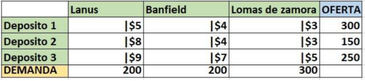
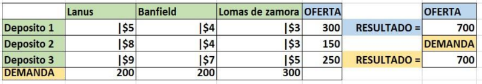
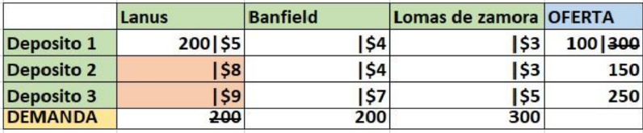
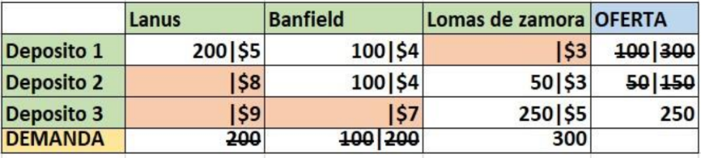
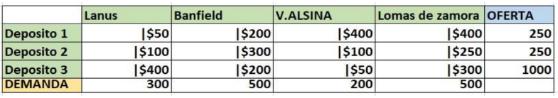
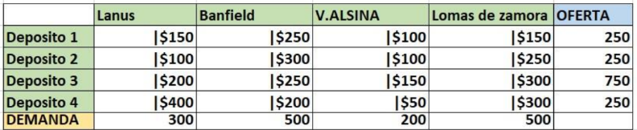
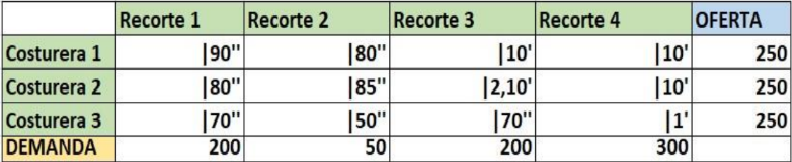

# Aproximación esquina Noroeste.

- Introducción:

    El **método de la esquina Noroeste** es una técnica que se usa para resolver problemas de transporte o distribución. Consiste en encontrar una solución inicial que cumpla con todas las condiciones del problema, pero no garantiza que se consiga el costo más bajo posible.

- Inicio del método.

    Para iniciar con este método, primero analizaremos una tabla de ejemplo. En ella se plantea un problema de transporte donde tres depósitos deben abastecer a tres locales en distintas zonas.

    
    

    El primer paso consiste en sumar la demanda de cada local (Lanús, Banfield y Lomas de Zamora) y compararla con la oferta total de los tres depósitos. A continuación, se muestra una imagen como ejemplo.

    

    Como se puede observar, la oferta y la demanda son iguales, lo que permite continuar con el método de la esquina Noroeste para encontrar una solución.

    > Mas adelante, veremos qué hacer en caso de que la oferta y la demanda no coincidan.

    El segundo paso es iniciar las asignaciones. En el méotod de la esquina Noroeste, comenzamos desde la esquina superior izquierda, asignando la mayor cantidad posible.

    En este caso, la primera asignación es del depósito 1 al local de lanús. La cantidad máxima asignable es `200 unidades`, ya que la demanda total de Lanís es 200 y la oferta del depósito es 300. Luego de la asignación, restamos este valor de la oferta, dejando un remanente de `100 unidades`.

    A continuación, se muestra una imagen que ilustra este ejemplo.

    

    En la imagen se puede observar que las celdas correspondientes a los depósitos 2 y 3 para el local de Lanús están marcadas en rojo. Esto se debe a que la demanda de Lanús ya ha sido satisfecha, aunque aún quedan `100 unidades disponibles` en el depósito 1.

    Siguiendo con las asignaciones, el siguiente destino a abastecer es Banfield. Como aún disponemos de `100 unidades` en el depósito 1, las enviamos allí. Sin embargo, esto no cubre toda la demanda de Banfield, por lo que utilizamos `100 unidades` adicionales del depósito 2 completar su abastecimiento.

    Ahora solo queda asignar las unidades restantes al local de Lomas de Zamora. Para ello, enviamos `50 unidades` desde el depósito 2 y 250 unidades desde el depósito 3. Con esto, logramos satisfaces por completo la demanda del local.

    Una vez finalizadas todas las asignaciones, solo resta calcular el resultado de la solución inicial.

    

    Para obtener el resultado de la solución inicial, es necesario multiplicar las unidades asignadas en cada celda por su respectivo costo de envío. Por ejemplo, para lanús, se multiplica `200 x 5`.

    Después de realizar todas las multiplicaciones correspondientes, sumamos los valores obtenidos para calcular el costo total de la solución inicial.

    A continuación, se muestra el cálculo detallado de esta solución.

    > (200×5)+(100×4)+(100×4)+(50×3)+(250×5)=3200

    El resultado de nuestra solución inicial es `3200`. Esto significa que, al distribuir los productos utilizando el método de la esquina Noroeste, el costo total es de `$3200`.

    Sin embargo, es importante recordar que este es solo un punto de partida y no necesariamente la solución más eficiente.

**Ejercicios:**
    Resuelva las siguientes tablas con el método de transporte esquina Noroeste:

1. 

2. 

 El costo en la siguiente tabla se expresa en unidades de tiempo, donde los segundos se representan con ('') y los minutos con ('), A continuación, se presenta la tabla de tareas:

3. 

4. Enunciado:

Para la elaboración de la tabla de tareas, utilizamos los siguientes datos:
La casa central de la empresa `DIA%` se encuentra ubicada en Juan Francisco Seguí 4646, CABA.
Para esta tarea, se dispone de cinco vehículos con las siguientes características:

- Fiat Fiorino: Costo de $50 por kilómetro y capacidad de 60 bultos.
- Renault Kangoo: Costo de $55 por kilómetro y capacidad de 65 bultos.
- Peugeot Partner: Costo de $65 por kilómetro y capacidad de 65 bultos.
- Renault Trafic: Costo de $90 por kilómetro y capacidad de 90 bultos.
- Fiat Ducato: Costo de $95 por kilómetro y capacidad de 90 bultos.

Debemos satisfacer la demanda de 5 supermercados `DIA%` con las siguientes direcciones y demandas:

- Supermercado `DIA%` en báez 222, CABA. Demanda de 78 bultos.
- Supermercado `DIA%` en Avenida Santa Fe 4550, CABA. Demanda de 70 bultos.
- Supermercado `DIA%` en Avenida Raúl Scalabrini Ortiz 3170, CABA. Demanda de 70 bultos.
- Supermercado `DIA%` en Fitz Roy 2292, CABA. Demanda de 74 bultos.
- Supermercado `DIA%` en Beruti 3434, CABA. Demanda de 74 bultos.

Una vez realizda la tabla de tareas, procederemos a obtener la solución inicial utilizando el méotod de esquina noroeste.